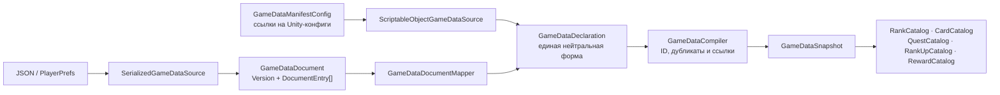
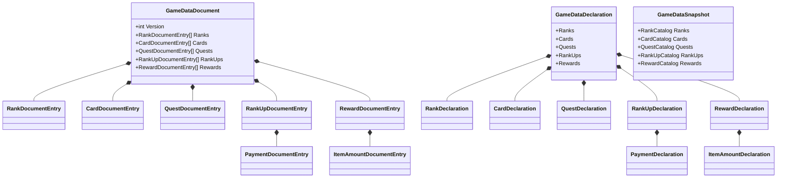
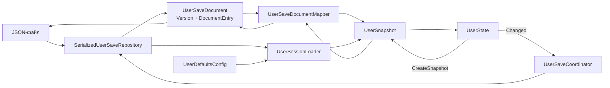

# Игровые и пользовательские данные

Этот документ объясняет, какие представления данных существуют в проекте, как они преобразуются друг в друга и
где искать код каждого этапа.

## Главное различие

Игровые и пользовательские данные решают разные задачи:

- игровые данные описывают общие правила и справочники: ранги, карты, задания, повышения и награды;
- пользовательские данные описывают состояние конкретного игрока: идентификатор, инвентарь, прогресс и активное
  задание повышения ранга.

Обе системы загружаются одним согласованным агрегатом, но жизненный цикл агрегатов различается:

- `GameDataSnapshot` создаётся при запуске и затем только читается;
- `UserSnapshot` создаётся при загрузке сессии, из него строится изменяемый `UserState`, а изменения состояния снова
  сохраняются через `UserSaveDocument`.

## Слои представления данных

| Представление | Для чего предназначено | Может содержать непроверенные данные |
| --- | --- | --- |
| `Config` и `Entry` | Редактирование данных в Unity Inspector | Да |
| `Document` и `DocumentEntry` | Стабильный версионируемый контракт JSON или другого внешнего формата | Да |
| `Declaration` | Единая форма игровых данных, не зависящая от источника | Да |
| `Compiler` | Общая проверка ID и связей, создание доменных объектов | Получает непроверенные данные |
| `Snapshot`, `Catalog`, `Definition` | Внутренние неизменяемые и согласованные данные приложения | Нет |
| `State` | Изменяемое состояние текущей пользовательской сессии | Нет |

`Config`, `Document` и `Declaration` не следует передавать игровым сервисам или UI. Потребители получают только
готовые каталоги, определения, снимки или интерфейсы состояния.

## Загрузка игровых данных



В текущей композиции `GameDataInstaller` выбирает путь через `ScriptableObjectGameDataSource`. Альтернативные пути
через JSON-файл и PlayerPrefs уже предоставляет `GameDataLoaderFactory`.

### Физическая раскладка игровых данных

```text
Game/Data/
├── Configuration/
│   └── GameDataManifestConfig.cs
├── Declarations/
│   ├── GameDataDeclaration.cs
│   ├── RankDeclaration.cs
│   ├── CardDeclaration.cs
│   ├── QuestDeclaration.cs
│   ├── RankUpDeclaration.cs
│   ├── PaymentDeclaration.cs
│   ├── RewardDeclaration.cs
│   └── ItemAmountDeclaration.cs
├── Persistence/
│   ├── Documents/
│   │   ├── GameDataDocument.cs
│   │   └── *DocumentEntry.cs
│   └── GameDataDocumentMapper.cs
├── Sources/
│   ├── ScriptableObjectGameDataSource.cs
│   └── SerializedGameDataSource.cs
├── GameDataCompiler.cs
├── GameDataLoader.cs
├── GameDataSnapshot.cs
└── IGameDataSource.cs
```

Корень `Game/Data` координирует загрузку агрегата. `Declarations` содержит только единое промежуточное представление,
которое создают все источники и принимает компилятор.

### Файлы игрового потока

| Файл или группа | Ответственность |
| --- | --- |
| `Configuration/GameDataManifestConfig.cs` | Корневой Unity-ассет, который ссылается на конфиги всех игровых каталогов |
| `IGameDataSource.cs` | Контракт источника: вернуть один `GameDataDeclaration` |
| `Sources/ScriptableObjectGameDataSource.cs` | Проверить Unity-конфиги и нормализовать их в `Declaration` |
| `Sources/SerializedGameDataSource.cs` | Загрузить и проверить версию внешнего `GameDataDocument` |
| `Persistence/Documents/GameDataDocument.cs` | Корневой версионируемый внешний контракт игровых данных |
| `Persistence/Documents/*DocumentEntry.cs` | Строки внешнего контракта для рангов, карт, заданий, повышений, оплат и наград |
| `Persistence/GameDataDocumentMapper.cs` | Чистое преобразование `Document` в `Declaration`, без I/O и проверки связей |
| `Declarations/GameDataDeclaration.cs` | Корень source-neutral представления со всеми наборами объявлений |
| `Declarations/*Declaration.cs` | Непроверенные объявления отдельных игровых сущностей |
| `GameDataCompiler.cs` | Найти пустые и повторяющиеся ID, проверить ссылки, создать доменные определения и каталоги |
| `GameDataSnapshot.cs` | Один неизменяемый согласованный результат загрузки |
| `GameDataLoader.cs` | Выполнить цепочку `source.Read()` → `compiler.Compile()` |
| `Composition/Factories/GameDataLoaderFactory.cs` | Собрать загрузчик для выбранной технологии хранения |
| `Composition/Installers/GameDataInstaller.cs` | Загрузить снимок и зарегистрировать его каталоги в DI |

### Состав агрегатов игровых данных



Файлы разделены, но агрегаты не раздроблены: источник всё ещё возвращает один `GameDataDeclaration`, а сериализатор
всё ещё читает один `GameDataDocument`.

## Загрузка и сохранение пользователя



`UserSessionLoader` сначала пытается загрузить сохранение. Если файла нет, он повреждён или имеет неподдерживаемую
версию, загрузчик создаёт `UserSnapshot` из `UserDefaultsConfig` и сохраняет его. Во время сессии `UserState`
объединяет изменяемые части состояния. `UserSaveCoordinator` подписывается на `UserState.Changed`, создаёт новый
снимок и передаёт его репозиторию.

### Файлы пользовательского потока

| Файл или группа | Ответственность |
| --- | --- |
| `Configuration/UserDefaultsConfig.cs` | Начальные значения пользователя и фабрика снимка по умолчанию |
| `Persistence/Documents/UserSaveDocument.cs` | Корневой версионируемый контракт сохранения |
| `Persistence/Documents/*DocumentEntry.cs` | Сериализуемые части identity, progress, rank-up quest и inventory |
| `Persistence/UserSaveDocumentMapper.cs` | Двустороннее преобразование `UserSaveDocument` ↔ `UserSnapshot` |
| `Persistence/IUserSaveRepository.cs` | Семантический контракт загрузки и сохранения пользователя |
| `Persistence/SerializedUserSaveRepository.cs` | I/O, проверка версии и классификация ошибок загрузки |
| `Persistence/UserLoadResult.cs` и `UserLoadStatus.cs` | Результат загрузки: loaded, not found, corrupted или unsupported version |
| `Persistence/UserSessionLoader.cs` | Выбрать сохранённый снимок либо создать и сохранить значения по умолчанию |
| `Snapshots/UserSnapshot.cs` | Корень неизменяемого снимка пользователя |
| `Snapshots/*Snapshot.cs` | Неизменяемые части identity, inventory, progress и rank-up quest |
| `State/UserState.cs` | Объединить изменяемые части сессии и сообщать об их изменениях |
| `State/Items`, `State/Progress`, `State/RankUp` | Изменяемое поведение отдельных пользовательских возможностей |
| `Persistence/UserSaveCoordinator.cs` | Сохранять новый снимок после изменения состояния |
| `Composition/Factories/UserSaveRepositoryFactory.cs` | Собрать JSON-сериализацию, файловое хранилище и репозиторий |
| `Composition/Installers/UserInstaller.cs` | Зарегистрировать загрузку снимка, состояние и автосохранение в DI |

## Как проследить данные при отладке

Для игровых данных:

1. Найти исходное значение в capability-конфиге и ссылку на него в `GameDataManifestConfig`.
2. Проверить преобразование в `ScriptableObjectGameDataSource`.
3. Проверить соответствующий `Declarations/*Declaration`.
4. Проверить в `GameDataCompiler` валидацию и создание доменного типа.
5. Найти итоговый `Catalog` в `GameDataSnapshot`.

Для пользовательских данных:

1. Проверить JSON и соответствующий `*DocumentEntry`.
2. Проверить преобразование в `UserSaveDocumentMapper`.
3. Найти значение в соответствующем `*Snapshot`.
4. Проверить изменяемую реализацию в `User/State`.
5. При проблеме сохранения пройти `UserState.Changed` → `UserSaveCoordinator` → `SerializedUserSaveRepository`.

## Как добавить новую группу игровых данных

1. Добавить доменный `Definition` и `Catalog` в capability, которому принадлежат данные.
2. Добавить capability-конфиг и его валидацию.
3. Добавить ссылку на конфиг в `GameDataManifestConfig`.
4. Добавить отдельный `Declarations/*Declaration.cs` и коллекцию в `GameDataDeclaration`.
5. Обновить `ScriptableObjectGameDataSource`.
6. Если поддерживается сериализованный источник, добавить `*DocumentEntry.cs`, поле в `GameDataDocument` и маппинг.
7. Обновить `GameDataCompiler` и `GameDataSnapshot`.
8. Зарегистрировать новый каталог в `GameDataInstaller`.
9. Запустить `tools/Validate-Architecture.ps1` и тесты.

При изменении внешнего формата следует решить, совместимо ли изменение со старым JSON. Для несовместимого изменения
нужно увеличить `CurrentVersion` и явно определить миграцию либо поведение для неподдерживаемой версии.
