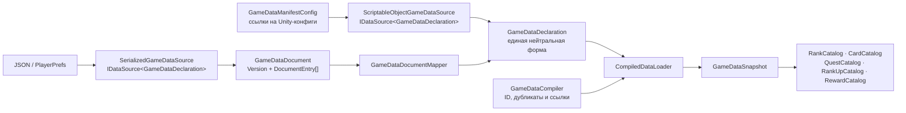
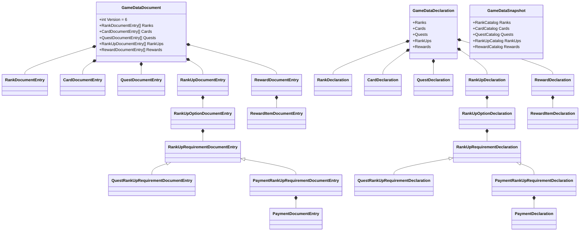
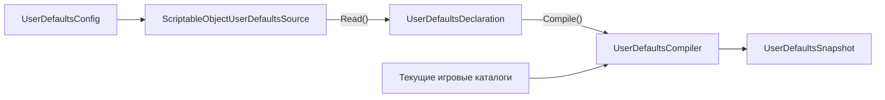
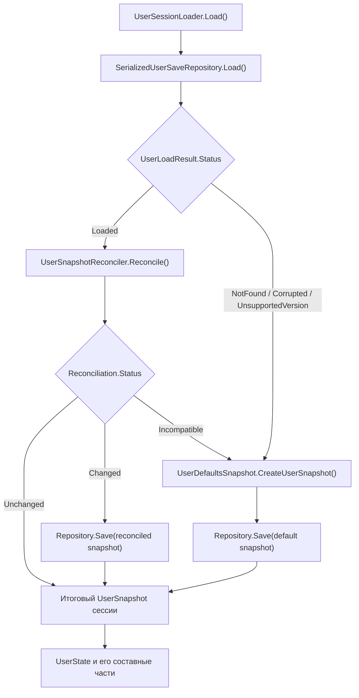

# Игровые и пользовательские данные

Этот документ объясняет, какие представления данных существуют в проекте, как они преобразуются друг в друга и
где искать код каждого этапа.

Текущая реализация группирует прогресс и независимые попытки повышения по `HeroId`. Повышение представлено набором
равноправных вариантов, каждый из которых содержит единый полиморфный список требований. Подробная модель определена
в [`Ranks-And-Rank-Up.md`](Ranks-And-Rank-Up.md).

## Главное различие

Игровые и пользовательские данные решают разные задачи:

- игровые данные описывают общие правила и справочники: ранги, карты, задания, повышения и награды;
- пользовательские данные описывают состояние конкретного игрока: идентификатор, выбранного героя, инвентарь,
  прогресс героев и их активные попытки повышения ранга.

Обе системы загружаются одним согласованным агрегатом через общий `IDataSource<TDeclaration>` и
`CompiledDataLoader<TDeclaration, TSnapshot>`, но жизненный цикл агрегатов различается:

- `GameDataSnapshot` создаётся при запуске и затем только читается;
- `UserSnapshot` создаётся при загрузке сессии, из него строится изменяемый `UserState`, а изменения состояния снова
  сохраняются через `UserSaveDocument`.

## Слои представления данных

| Представление | Для чего предназначено | Может содержать непроверенные данные |
| --- | --- | --- |
| `Config` и `Entry` | Редактирование данных в Unity Inspector | Да |
| `Document` и `DocumentEntry` | Стабильный версионируемый контракт JSON или другого внешнего формата | Да |
| `Declaration` | Единая форма игровых данных, не зависящая от источника | Да |
| `Compiler` | Общая проверка ID и связей, создание доменных объектов | Получает непроверенные данные |
| `Snapshot`, `Catalog`, `Definition` | Внутренние неизменяемые и согласованные данные приложения | Нет |
| `State` | Изменяемое состояние текущей пользовательской сессии | Нет |

`Config`, `Document` и `Declaration` не следует передавать игровым сервисам или UI. Потребители получают только
готовые каталоги, определения, снимки или интерфейсы состояния.

Компиляторы реализуют `IDataCompiler<TDeclaration, TSnapshot>` и принимают в `Compile` только исходную декларацию.
Стабильные каталоги, необходимые для разрешения ссылок, передаются компилятору через конструктор. Validation pipeline
собирает ошибки недоверенных представлений, а guard clauses runtime-объектов отдельно защищают программные контракты.

## Загрузка игровых данных

Загрузка игровых данных сейчас является синхронной: `IDataSource<TDeclaration>.Read()` возвращает декларацию до
вызова compiler. `ScriptableObject`-конфиги служат удобными таблицами для редактирования в Unity Inspector, а не
runtime-моделью. JSON и другие внешние форматы используют собственные версионируемые документы. Каждый адаптер
нормализует свой формат в одну source-neutral `GameDataDeclaration`, поэтому замена источника не меняет compiler,
snapshot, каталоги или игровые сервисы.



В текущей композиции `ProjectLifetimeScope` выбирает путь через `ScriptableObjectGameDataSource` и передаёт готовый
`IDataLoader<GameDataSnapshot>` в `GameDataInstaller`. Для сериализованного пути `GameDataLoaderFactory` принимает
независимо выбранные serializer и read-only storage, поэтому формат и среда хранения комбинируются без новых
factory-методов и не меняют installer или потребителей.

### Физическая раскладка игровых данных

```text
Game/Data/
├── Configuration/
│   └── GameDataManifestConfig.cs
├── Declarations/
│   ├── GameDataDeclaration.cs
│   ├── RankDeclaration.cs
│   ├── CardDeclaration.cs
│   ├── QuestDeclaration.cs
│   ├── RankUpDeclaration.cs
│   ├── PaymentDeclaration.cs
│   ├── RewardDeclaration.cs
│   └── RewardItemDeclaration.cs
├── Persistence/
│   ├── Documents/
│   │   ├── GameDataDocument.cs
│   │   └── *DocumentEntry.cs
│   └── GameDataDocumentMapper.cs
├── Sources/
│   ├── ScriptableObjectGameDataSource.cs
│   └── SerializedGameDataSource.cs
├── GameDataCompiler.cs
└── GameDataSnapshot.cs
```

Корень `Game/Data` координирует загрузку агрегата. `Declarations` содержит только единое промежуточное представление,
которое создают все источники и принимает компилятор.

### Раскладка Unity-ассетов

Классы конфигураций остаются рядом со своими фичами в коде, а созданные через Unity конфигурационные ассеты
группируются по владельцу:

```text
Assets/_Project/Configuration/
├── Game/
│   ├── CardCatalogConfig.asset
│   ├── GameDataManifestConfig.asset
│   ├── QuestCatalogConfig.asset
│   ├── RankCatalogConfig.asset
│   ├── RankUpCatalogConfig.asset
│   └── RewardCatalogConfig.asset
├── Presentation/
│   ├── FlagCatalogConfig.asset
│   └── ItemIconCatalogConfig.asset
├── UI/
│   └── WindowCatalogConfig.asset
└── User/
    └── UserDefaultsConfig.asset
```

Папка фичи внутри владельца нужна только для связанной группы из нескольких ассетов или осмысленной вложенной
структуры. Один ассет не получает отдельную папку только ради повторения иерархии C#-кода.

### Файлы игрового потока

| Файл или группа | Ответственность |
| --- | --- |
| `Configuration/GameDataManifestConfig.cs` | Корневой Unity-ассет, который ссылается на конфиги всех игровых каталогов |
| `Infrastructure/Loading/IDataSource.cs` | Общий контракт источника: вернуть одну source-neutral декларацию |
| `Sources/ScriptableObjectGameDataSource.cs` | Проверить Unity-конфиги и нормализовать их в `Declaration` |
| `Sources/SerializedGameDataSource.cs` | Загрузить и проверить версию внешнего `GameDataDocument` |
| `Persistence/Documents/GameDataDocument.cs` | Корневой версионируемый внешний контракт игровых данных |
| `Persistence/Documents/*DocumentEntry.cs` | Строки внешнего контракта для рангов, карт, заданий, повышений, оплат и наград |
| `Persistence/GameDataDocumentMapper.cs` | Чистое преобразование `Document` в `Declaration`, без I/O и проверки связей |
| `Declarations/GameDataDeclaration.cs` | Корень source-neutral представления со всеми наборами объявлений |
| `Declarations/*Declaration.cs` | Непроверенные объявления отдельных игровых сущностей |
| `GameDataCompiler.cs` | Найти пустые и повторяющиеся ID, проверить ссылки, создать доменные определения и каталоги |
| `GameDataSnapshot.cs` | Один неизменяемый согласованный результат загрузки |
| `Infrastructure/Loading/CompiledDataLoader.cs` | Выполнить общую цепочку `source.Read()` → `compiler.Compile()` |
| `Composition/Factories/GameDataLoaderFactory.cs` | Собрать загрузчик для выбранной технологии хранения |
| `Composition/Installers/GameDataInstaller.cs` | Загрузить снимок и зарегистрировать его каталоги в DI |

### Состав агрегатов игровых данных



Текущая версия внешнего контракта игровых данных — `GameDataDocument.CurrentVersion = 6`. Rank-up варианты хранят
единый `Requirements[]`; конкретная document-разновидность выбирается стабильным JSON-discriminator `Type`, описанным
в [`Ranks-And-Rank-Up.md`](Ranks-And-Rank-Up.md#представления-данных-и-json-контракт).

Файлы разделены, но агрегаты не раздроблены: источник всё ещё возвращает один `GameDataDeclaration`, а сериализатор
всё ещё читает один `GameDataDocument`.

## Загрузка и сохранение пользователя

Пользовательский поток состоит из трёх независимых частей: подготовки начальных значений, запуска сессии и
автосохранения изменяемого состояния. На схемах ниже стрелка означает порядок вызова или преобразования данных.

### Подготовка начальных значений

Начальные значения загружаются раньше пользовательского сохранения и не изменяются во время сессии:



`IDataSource<UserDefaultsDeclaration>` преобразует конкретный источник начальных значений в
`UserDefaultsDeclaration`. Декларация сохраняет те же смысловые группы, что и конфиг и снимок: `Identity`,
`HeroSelection`, `Heroes` и `Items`. Каждый элемент `Heroes` содержит собственные `HeroId`, ранг и опыт.

`UserDefaultsCompiler` сверяет декларацию с текущими игровыми каталогами: проверяет выбранного героя, стартовый ранг
и допустимый опыт каждого героя, а также наличие всех предметов, используемых встроенными правилами, картами,
оплатами и наградами. Результат — один согласованный `UserDefaultsSnapshot`, из которого при необходимости можно
создать нового пользователя.

### Запуск пользовательской сессии

`UserSessionLoader` управляет выбором итогового снимка сессии. Репозиторий скрывает чтение файла, JSON-десериализацию,
проверку версии документа и преобразование `UserSaveDocument` в `UserSnapshot`.



При успешной загрузке `UserSnapshotReconciler` согласует сохранение с текущими игровыми каталогами. Он заменяет
отсутствующего выбранного героя явным героем по умолчанию, добавляет отсутствующие обязательные предметы, удаляет
недействительные попытки повышения и очищает устаревшие состояния требований. Несовместимый прогресс конкретного
героя сбрасывается на его defaults.

Если согласование изменило снимок, `UserSessionLoader` сразу пытается записать исправленную версию. Если сохранение
не найдено, повреждено, имеет неподдерживаемую версию или в целом несовместимо, loader создаёт снимок из defaults и
тоже сразу пытается его записать. Ошибка этой стартовой записи логируется, но не препятствует созданию сессии.

### Автосохранение во время сессии

Во время игры изменяется `UserState`, а не загруженный `UserSnapshot`. `UserState` сворачивает изменения одной
синхронной игровой операции в одно уведомление `Changed`.

```mermaid
flowchart LR
    State["UserState"]
    Coordinator["UserSaveCoordinator"]
    Snapshot["Новый UserSnapshot"]
    Repository["SerializedUserSaveRepository.Save()"]
    Mapper["UserSaveDocumentMapper.ToDocument()"]
    Document["UserSaveDocument v2"]
    SaveService["SaveService.TrySave()"]
    Serializer["JsonSaveSerializer"]
    Bytes["JSON bytes"]
    FileStorage["FileSaveStorage.TryWrite()"]
    Temporary["user.save.tmp"]
    Storage["user.save"]

    State -- "Changed" --> Coordinator
    Coordinator -- "500 мс без новых изменений" --> Snapshot
    State -- "CreateSnapshot()" --> Snapshot
    Snapshot --> Repository
    Repository --> Mapper
    Mapper --> Document
    Document --> SaveService
    SaveService --> Serializer
    Serializer --> Bytes
    Bytes --> FileStorage
    FileStorage --> Temporary
    Temporary -- "атомарная замена" --> Storage
    Repository -. "ошибка: повтор через 500 мс" .-> Coordinator
```



Каждое новое уведомление переносит срок сохранения, поэтому в файл попадает последний итоговый снимок серии
изменений. После неудачной записи coordinator оставляет состояние dirty и повторяет попытки последовательно. При
завершении `Dispose()` выполняет ещё одну немедленную попытку записи dirty-состояния.

Текущая версия контракта пользовательского сохранения — `UserSaveDocument.CurrentVersion = 2`. Предыдущий формат не
мигрируется, поскольку опубликованных сохранений ещё нет; сохранение другой версии считается неподдерживаемым.

### Файлы пользовательского потока

| Файл или группа | Ответственность |
| --- | --- |
| `Configuration/UserDefaultsConfig.cs` | Unity-authoring начальных значений пользователя |
| `Infrastructure/Loading/IDataSource.cs` | Общий контракт любого статического источника деклараций |
| `Defaults/Sources/ScriptableObjectUserDefaultsSource.cs` | Преобразование Unity-конфига в source-neutral declaration |
| `Defaults/Declarations/*Declaration.cs` | Не проверенное представление начальных значений без зависимости от источника |
| `Defaults/UserDefaultsCompiler.cs` | Runtime-проверка ссылок и построение согласованного снимка начальных значений |
| `Defaults/UserDefaultsSnapshot.cs` | Неизменяемые начальные значения для создания нового пользователя |
| `Persistence/Documents/UserSaveDocument.cs` | Корневой версионируемый контракт сохранения |
| `Persistence/Documents/*DocumentEntry.cs` | Сериализуемые части identity, hero selection, heroes, rank-up attempts и inventory |
| `Persistence/UserSaveDocumentMapper.cs` | Двустороннее преобразование `UserSaveDocument` ↔ `UserSnapshot` |
| `Persistence/IUserSaveRepository.cs` | Семантический контракт загрузки и сохранения пользователя |
| `Persistence/SerializedUserSaveRepository.cs` | I/O, проверка версии и классификация ошибок загрузки |
| `Persistence/UserLoadResult.cs` и `UserLoadStatus.cs` | Результат загрузки: loaded, not found, corrupted или unsupported version |
| `Persistence/UserSessionLoader.cs` | Выбрать согласованный сохранённый снимок либо создать значения по умолчанию |
| `Persistence/UserSnapshotReconciler.cs` | Согласовать героев, ранги, предметы, варианты повышения и состояния их требований |
| `Snapshots/UserSnapshot.cs` | Корень неизменяемого снимка пользователя |
| `Snapshots/*Snapshot.cs` | Неизменяемые части identity, hero selection, heroes, rank-up attempts и inventory |
| `State/UserState.cs` | Объединить части сессии и пакетировать уведомления составных операций |
| `State/Items`, `State/Heroes`, `State/RankUp` | Read-интерфейсы, command-интерфейсы и состояние пользовательских возможностей |
| `Persistence/UserSaveCoordinator.cs` | Debounce, последовательный retry и финальный flush нового снимка состояния |
| `Composition/Factories/UserDefaultsSourceFactory.cs` | Выбрать конкретный источник начальных значений |
| `Composition/Factories/UserSaveRepositoryFactory.cs` | Собрать JSON-сериализацию, файловое хранилище и репозиторий |
| `Composition/Installers/UserInstaller.cs` | Зарегистрировать загрузку снимка, состояние и автосохранение в DI |

## Как проследить данные при отладке

Для игровых данных:

1. Найти исходное значение в capability-конфиге и ссылку на него в `GameDataManifestConfig`.
2. Проверить преобразование в `ScriptableObjectGameDataSource`.
3. Проверить соответствующий `Declarations/*Declaration`.
4. Проверить в `GameDataCompiler` валидацию и создание доменного типа.
5. Найти итоговый `Catalog` в `GameDataSnapshot`.

Для начальных пользовательских данных:

1. Найти значение в `UserDefaultsConfig`.
2. Проверить преобразование в `ScriptableObjectUserDefaultsSource`.
3. Проверить соответствующий `Defaults/Declarations/*Declaration`.
4. Проверить runtime-валидацию в `UserDefaultsCompiler`.
5. Найти итоговое значение в `UserDefaultsSnapshot`.

Для сохранённого состояния пользователя:

1. Проверить JSON и соответствующий `*DocumentEntry`.
2. Проверить преобразование в `UserSaveDocumentMapper`.
3. Найти значение в соответствующем `*Snapshot`.
4. Проверить изменяемую реализацию в `User/State`.
5. При проблеме сохранения пройти `UserState.Changed` → `UserSaveCoordinator` → `SerializedUserSaveRepository`.

UI получает неизменяемый снимок выбранного героя и только read-интерфейсы `IUserItems`, `IUserHeroProgress` и
`IUserRankUpAttempts`. Изменения выполняют игровые
сервисы через соответствующие `*Commands` интерфейсы. Например, кнопка добавления карты вызывает
`CardCollectionService`, а не изменяет пользовательский инвентарь напрямую.

## Как добавить новую группу игровых данных

1. Добавить доменный `Definition` и `Catalog` в capability, которому принадлежат данные.
2. Добавить capability-конфиг и его валидацию.
3. Добавить ссылку на конфиг в `GameDataManifestConfig`.
4. Добавить отдельный `Declarations/*Declaration.cs` и коллекцию в `GameDataDeclaration`.
5. Обновить `ScriptableObjectGameDataSource`.
6. Если поддерживается сериализованный источник, добавить `*DocumentEntry.cs`, поле в `GameDataDocument` и маппинг.
7. Обновить `GameDataCompiler` и `GameDataSnapshot`.
8. Зарегистрировать новый каталог в `GameDataInstaller`.
9. Запустить `tools/Validate-Architecture.ps1` и тесты.

При изменении внешнего формата следует решить, совместимо ли изменение со старым JSON. Для несовместимого изменения
нужно увеличить `CurrentVersion` и явно определить миграцию либо поведение для неподдерживаемой версии.
