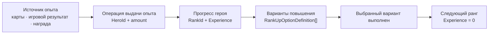

# Ранги, опыт и повышение героев

Этот документ определяет целевую модель рангового прогресса и повышения героев. Он отделяет накопление опыта от
перехода на следующий ранг и фиксирует расширяемую модель вариантов повышения. Общие правила размещения типов и
направления зависимостей остаются в [`Architecture.md`](../Standards/Architecture.md), а представления игровых и
пользовательских данных — в [`Game-And-User-Data.md`](Game-And-User-Data.md).

Production-код реализует описанную ниже модель для игровых данных, пользовательского состояния и сервисного слоя.
Текущее окно повышения адаптирует авторские варианты к двум существующим визуальным слотам prefab; это ограничение
presentation, а не доменной модели. Поскольку опубликованных сохранений ещё нет, миграция прежнего пользовательского
формата не выполнялась.

## Границы возможностей

Ранговый прогресс и повышение решают разные задачи:

- `Game/Ranks` определяет ранги, пороги опыта и расчёт прогресса внутри текущего ранга;
- `Game/Upgrades` и другие игровые возможности определяют конкретные источники опыта;
- единая операция выдачи опыта применяет рассчитанное количество к указанному герою;
- `Game/RankUp` определяет альтернативные способы перейти с достигнутого ранга на следующий;
- `User` хранит отдельные ранг, опыт и незавершённые процессы повышения каждого героя.

Получение максимального количества опыта не повышает героя автоматически. Оно только открывает доступ к вариантам
повышения, определённым для пары `HeroId` и `RankId`.



## Опыт принадлежит герою

Ранг и опыт никогда не являются глобальным прогрессом пользователя. Каждая операция выдачи опыта принимает явный
`HeroId`, даже если в игре пока доступен только один герой:

```csharp
bool TryGrantExperience(HeroId heroId, int amount);
```

Источник опыта отвечает только за собственные правила. Например, применение карточек проверяет и расходует карты,
вычисляет опыт, а затем передаёт итоговое количество общей операции выдачи опыта. Результат матча может вызвать ту
же операцию без зависимости от карточек. Общая операция выдачи опыта не должна знать, откуда получено значение.

`SelectedHeroId` используется для навигации и отображения, но не заменяет `HeroId` в игровой команде. Асинхронный
результат матча, callback или подтверждение окна должны изменить героя, указанного самой операцией, даже если текущий
выбор пользователя уже изменился.

## Повышение как набор альтернативных вариантов

`RankUpDefinition` описывает одно повышение конкретного героя с конкретного ранга и содержит непустой набор
альтернативных вариантов:

```text
RankUpDefinition
├── HeroId
├── RankId
├── RewardId
└── Options[]
    └── RankUpOptionDefinition
        ├── OptionId
        └── Requirements[]
```

Каталог разрешает определение по составному ключу `(HeroId, RankId)`. Не следует индексировать повышения только по
`RankId`: разные герои могут иметь разные требования и баланс на одном ранге.

Термины `quest path`, `instant path` и `bypass path` не являются частью доменной модели. Они описывают лишь отдельные
настройки данных. Любой вариант — равноправный способ повышения, выбранный по `RankUpOptionId`.

Требования внутри одного варианта объединяются логическим `AND`: должны быть выполнены все. Разные варианты
объединяются логическим `OR`: для повышения достаточно успешно завершить один из них.

```text
Option A = QuestCompleted AND PaySoft
             OR
Option B = PayHard
             OR
Option C = ExternalConfirmation
```

Бесплатный вариант представлен пустым набором требований. Отдельный `FreeRequirement` не нужен: отсутствие условий
точнее выражает отсутствие ограничений и не создаёт фиктивную игровую сущность.

## Требование повышения

`RankUpRequirementDefinition` — неизменяемое игровое описание одного факта или обязательства, необходимого для
завершения варианта. Конкретные типы требований могут отличаться жизненным циклом:

| Категория | Пример | Сохранённый прогресс | Расходуется при повышении |
| --- | --- | --- | --- |
| Накопительное | Сделать 20 хедшотов этим героем | Да | Нет |
| Временное | Выполнить задание за 24 часа | Да, включая абсолютный дедлайн | Нет |
| Наблюдаемое | Иметь на балансе 300 000 валюты | Нет | Нет |
| Расходуемое | Заплатить 10 000 soft или 100 hard | Нет | Да |
| Внешнее подтверждение | Посмотреть рекламу или подтвердить действие платформы | Только подтверждающий токен | Обычно токен |

Примерные конкретные определения:

```text
QuestRankUpRequirementDefinition
CountedEventRankUpRequirementDefinition
CurrencyBalanceRankUpRequirementDefinition
PaymentRankUpRequirementDefinition
ExternalConfirmationRankUpRequirementDefinition
```

Не следует создавать один универсальный DTO с набором необязательных полей для всех будущих механик. Каждый
конкретный тип требования хранит только собственные параметры и проверяется своим обработчиком. Новый тип добавляется
при появлении реальной механики, а не заранее в виде большого перечисления гипотез.

### Условие и расход — один список, разное поведение

Для `RankUpOptionDefinition` и выполненный квест, и платёж являются требованиями, однако их обработчики ведут себя
по-разному:

- накопительное требование наблюдает игровые события и сообщает готовность;
- наблюдаемое требование вычисляет готовность из текущего состояния;
- расходуемое требование сначала проверяет ресурс, а при завершении варианта атомарно расходует его;
- внешнее действие выполняется своей системой, а повышение получает проверяемое подтверждение результата.

`RankUpService` координирует эти обработчики, но не содержит правила хедшотов, валютного баланса, рекламы или
конкретного способа оплаты.

## Идентичность и состояние требований

Каждый вариант имеет стабильный `RankUpOptionId`, а каждое требование с сохраняемым состоянием внутри варианта —
стабильный `RankUpRequirementId`. Идентификаторы необходимы для сопоставления определения с сохранённым прогрессом и
не должны строиться из позиции элемента в массиве.

Пользовательское состояние группируется по героям:

```text
UserSnapshot
├── HeroSelection
│   └── SelectedHeroId
├── Heroes[]
│   └── UserHeroSnapshot
│       ├── HeroId
│       ├── Progress
│       │   ├── RankId
│       │   └── Experience
│       └── RankUpAttempts[]
│           └── UserRankUpAttemptSnapshot
│               ├── RankId
│               ├── OptionId
│               └── RequirementStates[]
└── Items
```

`RankUpAttempts` допускает независимые процессы разных героев и не связывается с `SelectedHeroId`. Если у солдата и
капитана идут задания с разными дедлайнами, переключение выбранного героя не приостанавливает и не заменяет ни одно
из них.

Конкретное состояние требования остаётся типизированным. Например, счётное требование хранит `CurrentCount`, а
временное — абсолютный `DeadlineUnixMilliseconds`. Не следует сохранять параметры определения, такие как
`RequiredCount`, цена или продолжительность: они читаются из актуальных игровых данных. Не следует также использовать
нетипизированный словарь или непрозрачный JSON-blob как постоянный runtime-контракт прогресса.

Если несколько вариантов одного повышения содержат длительные требования, модель допускает отдельную попытку для
каждого варианта. Ограничение «у героя может быть активна только одна длительная попытка» является отдельным игровым
правилом и не должно следовать из формы сохранения. После успешного повышения очищаются все попытки героя для
предыдущего `RankId`.

## Жизненный цикл варианта

Игровая граница повышения оперирует идентификатором варианта, а не переданной из UI оплатой или конкретным квестом:

```csharp
IReadOnlyList<RankUpOptionStatus> GetOptions(HeroId heroId);

bool TryActivateOption(HeroId heroId, RankUpOptionId optionId);

bool TryCompleteOption(
    HeroId heroId,
    RankUpOptionId optionId,
    out IReadOnlyList<ItemAmount> rewardItems);
```

`TryActivateOption` создаёт состояние только для требований, которым нужен момент начала, например дедлайн или
счётчик событий после принятия. Наблюдаемые и расходуемые требования не обязаны иметь пользовательскую попытку.

`TryCompleteOption` выполняет одну согласованную операцию:

1. Находит `RankUpDefinition` по `HeroId` и текущему `RankId` героя.
2. Находит вариант по `RankUpOptionId` и проверяет, что герой набрал необходимый опыт.
3. Выполняет read-only проверку всех требований варианта.
4. Проверяет возможность выдать награду и применить следующий ранг.
5. Подготавливает или расходует все расходуемые требования.
6. Повышает указанного героя и обнуляет опыт нового ранга.
7. Выдаёт награду.
8. Очищает попытки повышения завершённого ранга.
9. Публикует одно пакетное изменение пользовательского состояния.

Ошибка до изменения состояния ничего не расходует. Если расход уже произошёл, последующий сбой обязан восстановить
его либо использовать заранее подготовленную резервацию с commit/rollback. Внешне необратимое действие, например
показ рекламы, не запускается внутри этой транзакции: внешняя система сначала выдаёт подтверждение, а обработчик
повышения проверяет и расходует подтверждающий токен.

## Обработчики требований

Доменное определение не содержит DI-зависимостей и не изменяет пользовательское состояние. Поведение конкретной
разновидности предоставляет обработчик на границе игрового сервиса:

```csharp
internal interface IRankUpRequirementHandler
{
    bool CanHandle(RankUpRequirementDefinition definition);

    RankUpRequirementStatus GetStatus(
        HeroId heroId,
        RankUpRequirementDefinition definition);

    bool TryActivate(
        HeroId heroId,
        RankUpRequirementDefinition definition);

    bool TryCommit(
        HeroId heroId,
        RankUpRequirementDefinition definition);

    bool TryRollback(
        HeroId heroId,
        RankUpRequirementDefinition definition);

    void Clear(
        HeroId heroId,
        RankUpRequirementDefinition definition);
}
```

Это целевая форма ответственности, а не требование немедленно вводить универсальный handler registry. Пока
реализованы только квест и оплата, допустима простая явная композиция. Реестр становится оправданным, когда появляется
вторая независимо заменяемая разновидность требования и общий цикл действительно устраняет дублирование.

UI и Presentation не получают command-интерфейсы пользовательского состояния. UI вызывает `RankUpService`, а для
отображения получает read-only статусы вариантов и требований. Локализованное описание и выбор конкретного визуального
компонента принадлежат `Presentation/RankUp` и `UI/Windows/RankUp`; игровые определения не зависят от TMPro, окон или
спрайтов.

## Примеры конфигураций

### Задание и две альтернативы

```text
Soldier, Rank 2 -> Rank 3

Option "quest-and-soft"
├── CompleteQuest(20 headshots, 24 hours)
└── Payment(10 000 soft)

Option "hard"
└── Payment(100 hard)
```

После пяти хедшотов состояние первого варианта принадлежит солдату и хранит `5 / 20` с абсолютным дедлайном. Выбор
варианта `hard` повышает солдата, расходует hard и очищает незавершённую попытку. Состояние капитана не изменяется.

### Бесплатное повышение после условия

```text
Captain, Rank 2 -> Rank 3

Option "earned-currency"
└── EarnCurrency(300 000)
```

После выполнения требования дополнительных действий нет: список содержит одно требование, а отдельная цена
отсутствует.

### Полностью бесплатный вариант

```text
EventHero, Rank 1 -> Rank 2

Option "event-free"
└── Requirements = []
```

Такой вариант доступен сразу после достижения требуемого опыта. Пустой список должен быть намеренно разрешён в
authoring-данных и явно отображаться как бесплатный вариант.

### Три способа повышения

```text
Option A = CompleteQuest AND Payment(soft)
Option B = Payment(hard)
Option C = ExternalConfirmation(rewarded-ad)
```

Количество вариантов не зашито в сервис или UI. UI строит список из каталога и передаёт выбранный `OptionId` обратно
игровому сервису.

## Валидация игровых данных

Компилятор rank-up данных обязан проверять:

- существование `HeroId`, исходного `RankId`, следующего ранга и `RewardId`;
- уникальность составного ключа `(HeroId, RankId)`;
- наличие хотя бы одного варианта;
- уникальность `RankUpOptionId` внутри определения;
- уникальность `RankUpRequirementId` внутри варианта, когда требование имеет сохраняемое состояние;
- корректность ссылок и параметров каждого конкретного требования;
- наличие runtime-обработчика для каждой скомпилированной разновидности требования;
- явную допустимость пустого списка требований как бесплатного варианта;
- отсутствие обязательной зависимости UI или Presentation для выполнения требования.

При загрузке пользовательского состояния reconciler проверяет `HeroId`, `RankId`, `OptionId` и идентичность
сохраняемых требований относительно актуального каталога. Исчезнувшая или несовместимо изменённая попытка очищается
явно; она не должна блокировать остальные герои или сбрасывать глобальный инвентарь.

## Целевое размещение

```text
Game/
├── Ranks/
│   ├── RankDefinition.cs
│   ├── RankCatalog.cs
│   ├── RankProgress.cs
│   └── RankProgression.cs
├── Upgrades/
│   └── Services/
│       └── CardExperienceService.cs
└── RankUp/
    ├── RankUpDefinition.cs
    ├── RankUpOptionDefinition.cs
    ├── RankUpOptionId.cs
    ├── RankUpRequirementDefinition.cs
    ├── RankUpRequirementId.cs
    ├── RankUpCatalog.cs
    ├── Requirements/
    └── Services/

User/
├── Snapshots/
│   ├── UserHeroSnapshot.cs
│   ├── UserProgressSnapshot.cs
│   └── UserRankUpAttemptSnapshot.cs
└── State/
    ├── Heroes/
    └── RankUp/
```

`Requirements` является feature-local группировкой конкретных разновидностей требований и не вводит новый
project-wide role folder. Создавать её следует только вместе с несколькими конкретными типами; одна реализация
остаётся в корне `Game/RankUp`.

## Состояние реализации

- `UserHeroes` хранит независимые `Progress` и `RankUpAttempts` каждого героя.
- `IHeroExperienceService` принимает явный `HeroId`; карточки являются одним из источников опыта.
- `RankUpDefinition` содержит варианты с устойчивыми `RankUpOptionId`, а вариант — набор требований.
- Реализованы квестовые и платёжные требования; пустой набор требований представляет бесплатный вариант.
- `RankUpService` принимает `HeroId` и `RankUpOptionId`, проверяет все требования и завершает выбранный вариант.
- игровые документы используют версию 5, user save document — версию 2; defaults и сохранение группируют состояние
  по героям.
- текущий `RankUpWindow` показывает два существующих prefab-слота: первый вариант с квестом и первый оставшийся
  вариант. Для одновременного отображения трёх и более вариантов нужен отдельный динамический список presentation,
  при этом игровые данные, сохранение и сервисы уже не требуют изменения.
