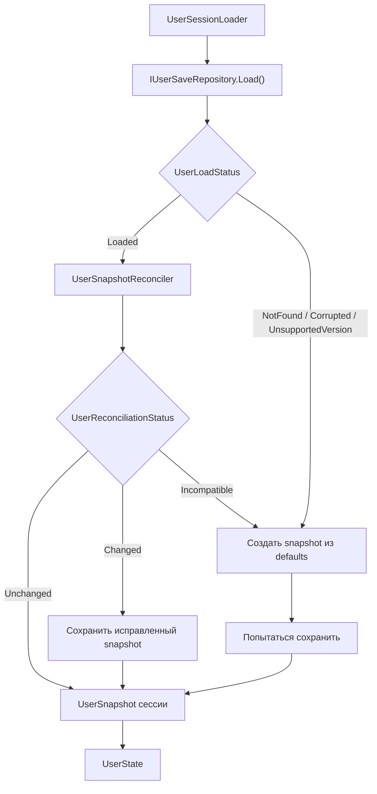

# Пользовательские данные

Пользовательские данные описывают конкретного игрока: identity, выбранного героя, прогресс героев, активные попытки
повышения и инвентарь. Их поток состоит из трёх частей: defaults нового пользователя, загрузки сессии и сохранения
изменяемого состояния.

Нормативные правила размещения и зависимостей определены в
[`Architecture.md`](../Standards/Architecture.md). Игровые каталоги описаны в [`Game-Data.md`](Game-Data.md), а модель
прогресса и повышения — в [`Ranks-And-Rank-Up.md`](Ranks-And-Rank-Up.md).

## Defaults нового пользователя

```text
UserDefaultsConfig
    -> ScriptableObjectUserDefaultsSource
    -> UserDefaultsDeclaration
    -> CompiledDataLoader + UserDefaultsCompiler
    -> UserDefaultsSnapshot
```

`UserDefaultsCompiler` использует актуальные игровые каталоги: проверяет героев, выбранного героя, ранг и опыт, а
также наличие предметов, на которые ссылаются встроенные правила, карты, оплаты и награды. Результат неизменяем и
служит только для создания нового пользователя или восстановления несовместимого сохранения.

| Представление | Ответственность |
| --- | --- |
| `UserDefaultsConfig` | Unity-authoring начальных значений |
| `UserDefaultsDeclaration` и вложенные декларации | Непроверенное source-neutral представление |
| `UserDefaultsCompiler` | Проверка ссылок на игровые данные и создание defaults |
| `UserDefaultsSnapshot` | Согласованные начальные значения |

## Загрузка сессии



Репозиторий скрывает I/O, JSON-десериализацию, проверку версии и mapping между `UserSaveDocument` и `UserSnapshot`.
`UserSaveDocument.CurrentVersion` сейчас равен `1`.

Миграции и обратная совместимость сохранений пока не поддерживаются. Документ с любой другой версией получает статус
`UnsupportedVersion`; `UserSessionLoader` не пытается его преобразовать, а создаёт новый `UserSnapshot` из
`UserDefaultsSnapshot` и пытается сразу сохранить его в текущем формате с версией `1`.

`UserSnapshotReconciler` согласует сохранение с текущими игровыми данными. Он:

- удаляет неизвестных и повторяющихся героев, добавляет отсутствующих героев из defaults;
- сбрасывает несовместимый прогресс героя на его defaults;
- восстанавливает выбранного героя и обязательные предметы из defaults;
- удаляет недействительные попытки повышения и устаревшие состояния заданий.

Исправленный snapshot сохраняется сразу. При отсутствии, повреждении, неподдерживаемой версии или полной
несовместимости создаётся snapshot из defaults. Ошибка этой стартовой записи логируется, но не блокирует сессию.

## Состояние и автосохранение

Во время сессии изменяется `UserState`, а `UserSnapshot` остаётся точкой во времени. UI получает
`UserHeroSelectionSnapshot` и read-интерфейсы `IUserItems`, `IUserHeroProgress`, `IUserRankUpAttempts`. Изменения идут
через игровые сервисы и отдельные `*Commands` интерфейсы, а не напрямую из UI.

```text
game service -> *Commands -> UserState.Changed
    -> UserSaveCoordinator
    -> UserState.CreateSnapshot()
    -> IUserSaveRepository.Save()
    -> UserSaveDocument -> JSON -> file
```

`UserState` объединяет изменения одной синхронной игровой операции в одно уведомление. `UserSaveCoordinator` ждёт
`500 мс` после последнего изменения, последовательно сохраняет свежий snapshot, повторяет неудачную запись и при
`Dispose()` делает финальную попытку для dirty-состояния. Файловое хранилище пишет временный файл и затем заменяет
основной.

## Где искать код

| Путь | Что находится |
| --- | --- |
| `User/Configuration` | `UserDefaultsConfig` и его authoring-валидация |
| `User/Defaults` | Декларации, источник, compiler и snapshot defaults |
| `User/Persistence/Documents` | Версионируемый контракт сохранения |
| `User/Persistence` | Репозиторий, mapping, reconciliation, загрузка сессии и autosave |
| `User/Snapshots` | Неизменяемое представление пользователя |
| `User/State` | Mutable state и разделённые read/command-интерфейсы |
| `Composition/Factories/User*Factory.cs` | Выбор источника defaults и технологии сохранения |
| `Composition/Installers/UserInstaller.cs` | Загрузка, state и lifecycle-регистрации |

Unity-ассет defaults находится в `Assets/_Project/Configuration/User/UserDefaultsConfig.asset`.

## Отладка

Для defaults:

```text
UserDefaultsConfig -> source -> declaration -> UserDefaultsCompiler -> UserDefaultsSnapshot
```

Для сохранённого или изменяемого значения:

```text
JSON -> document -> UserSaveDocumentMapper -> UserSnapshot -> UserState
UserState.Changed -> UserSaveCoordinator -> repository -> JSON
```

При несовместимом изменении внешнего формата нужно увеличить версию. Пока действует текущая политика, сохранение
предыдущей версии будет сброшено до defaults; добавление миграции потребует отдельного архитектурного решения.
Обязательные проверки перечислены в
[`Validation.md`](../Standards/Validation.md).
